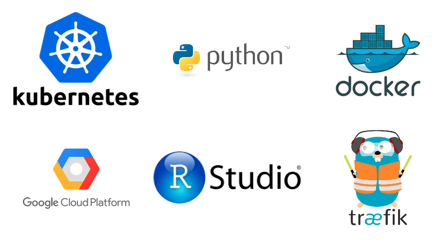

# Orchestra

The Orchestra platform aims to facilitate data science education. The current iteration supports
a flexible approach to making workshop or tutorial materials available to any user anywhere in the 
world via an Rstudio, Jupyter Notebook, or any other web-based data science framework (including 
LearnR shiny apps, for example).

[Give it a try.](http://workshop.bioc.cancerdatasci.org/)

## For users

A simple **Choose a Workshop** page presents all available environments for workshops. Choose one, 
enter your email, and within a minute or so, you get a dedicated compute environment with all
necessary software installed and workshop materials available.

## For instructors

Use the [BuildAWorkshop](https://github.com/seandavi/BuildABiocWorkshop2020) template repo **or**
simply create a docker image that presents a web application (Rstudio, Jupyter Lab, Shiny App, etc)
and [send me an email](mailto:seandavi@gmail.com).

# Technical notes

We use these projects:



## Running workshop monitoring


A snapshot of a running infrastructure:


## Prometheus monitoring

``` shell
helm install prometheus stable/prometheus
```

``` shell
NAME: prometheus
LAST DEPLOYED: Tue Jul 28 20:02:17 2020
NAMESPACE: default
STATUS: deployed
REVISION: 1
TEST SUITE: None
NOTES:
The Prometheus server can be accessed via port 80 on the following DNS name from within your cluster:
prometheus-server.default.svc.cluster.local


Get the Prometheus server URL by running these commands in the same shell:
  export POD_NAME=$(kubectl get pods --namespace default -l "app=prometheus,component=server" -o jsonpath="{.items[0].metadata.name}")
  kubectl --namespace default port-forward $POD_NAME 9090


The Prometheus alertmanager can be accessed via port 80 on the following DNS name from within your cluster:
prometheus-alertmanager.default.svc.cluster.local


Get the Alertmanager URL by running these commands in the same shell:
  export POD_NAME=$(kubectl get pods --namespace default -l "app=prometheus,component=alertmanager" -o jsonpath="{.items[0].metadata.name}")
  kubectl --namespace default port-forward $POD_NAME 9093
#################################################################################
######   WARNING: Pod Security Policy has been moved to a global property.  #####
######            use .Values.podSecurityPolicy.enabled with pod-based      #####
######            annotations                                               #####
######            (e.g. .Values.nodeExporter.podSecurityPolicy.annotations) #####
#################################################################################


The Prometheus PushGateway can be accessed via port 9091 on the following DNS name from within your cluster:
prometheus-pushgateway.default.svc.cluster.local


Get the PushGateway URL by running these commands in the same shell:
  export POD_NAME=$(kubectl get pods --namespace default -l "app=prometheus,component=pushgateway" -o jsonpath="{.items[0].metadata.name}")
  kubectl --namespace default port-forward $POD_NAME 9091

For more information on running Prometheus, visit:
https://prometheus.io/
```

### Grafana

``` shell
helm search repo graphana
helm inspect values stable/grafana > grafana/values.yaml
```

``` shell
kubectl create secret generic orchestra-password \
    --from-literal='orchestra-password=<MYPASSWORD>'
```

## Google Kubernetes Cluster

### Resizing a cluster

To [resize a cluster's node pools](https://cloud.google.com/kubernetes-engine/docs/how-to/resizing-a-cluster), run the following command:

``` shell
gcloud container clusters resize cluster-name --node-pool pool-name \
    --num-nodes num-nodes
```

Replace the following:

- cluster-name: the name of the cluster to resize.
- pool-name: the name of the node pool to resize.
- num-nodes: the number of nodes in the pool in a zonal cluster. If you use multi-zonal or regional clusters, num-nodes is the number of nodes for each zone the node pools is in.
Repeat this command for each node pool. If your cluster has only one node pool, omit the --node-pool flag.

For more information, refer to the [gcloud container clusters](https://cloud.google.com/sdk/gcloud/reference/container/clusters/resize) resize documentation.
